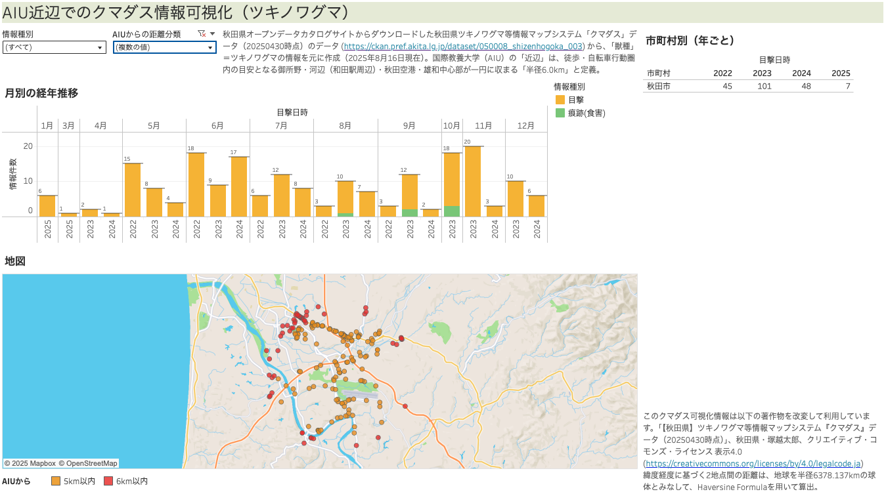
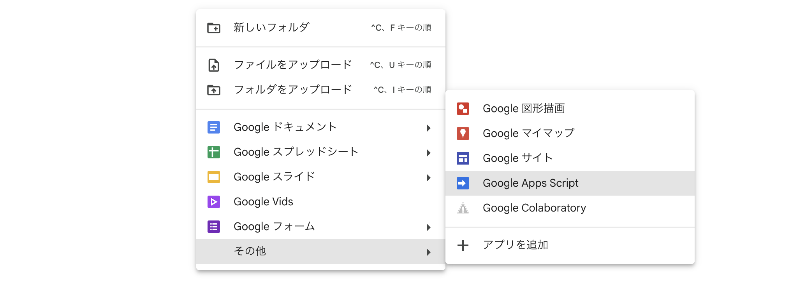
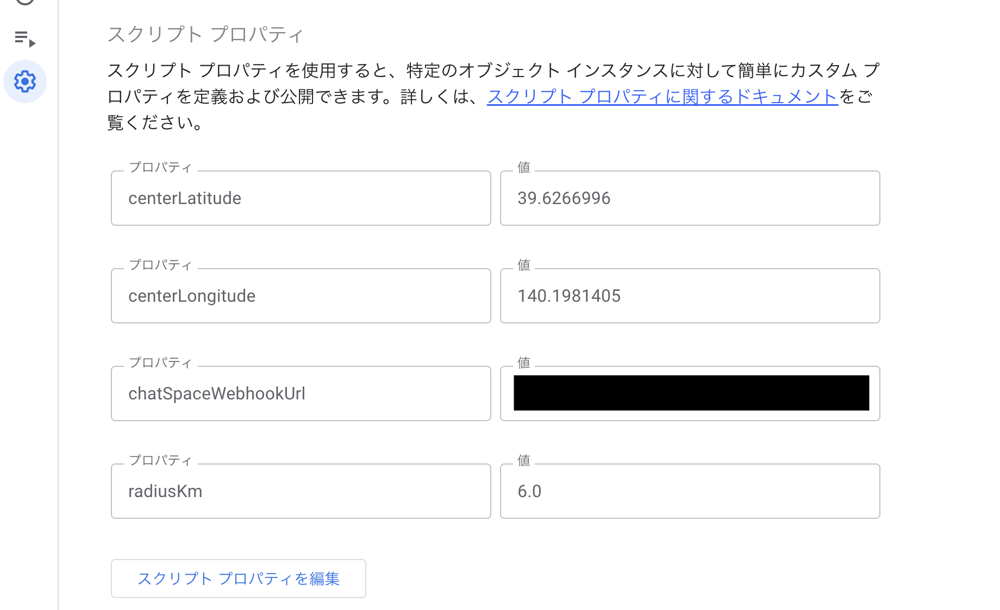
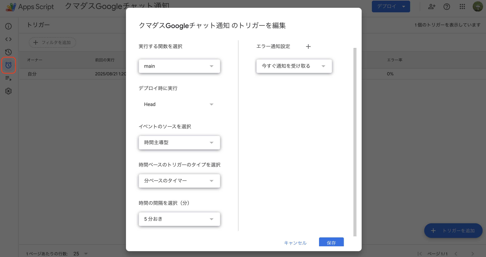

# kumadas-chat

   
 

秋田県ツキノワグマ等情報マップシステム【クマダス】のメール通知をもとに、緯度・経度で指定した場所から任意の半径以内でのツキノワグマ目撃情報を、Google Chatスペースに転送するためのGoogle Apps Script。

> [!NOTE]  
> 本稿において別途明示されていない場合、データのダウンロードやウェブページの最終確認は2025年8月16日時点となっている。

## 背景

> [!TIP]
> 背景は飛ばして、実装の具体的な方法を確認したい方は [`設定方法` セクション](#設定方法)から読み進めるのがオススメ。

### クマの出没増加

日本におけるクマ類の出没件数は、数年周期で増減を繰り返す傾向が知られている[^1]が、2016年以降はその高止まりが続いている[^2]。

[^1]: [環境省「クマに関する各種情報・取組」](https://www.env.go.jp/nature/choju/effort/effort12/effort12.html)

[^2]: [環境省「クマ類の生息状況、被害状況等について」](https://www.env.go.jp/nature/choju/effort/effort12/kuma-situation.pdf)

豊かな森林資源を有する秋田県においては特に、人口減少や高齢化と連動するように、人の生活圏が縮小に伴ってクマの分布域が拡大している[^3]。ツキノワグマの出没件数が、全国的に2009年以降の過去最多を記録した2023年4月～12月では、岩手県と秋田県だけでツキノワグマの出没件数が全国の約4割を占めた[^2]。秋田市内においても、2024年2月に発生した倉庫内での居座り[^4]、同11月のスーパー侵入[^5]、同12月の自動車整備工場内での居座り[^6]などが記憶に新しい。

[^3]: [秋田県「クマについてよくあるご意見・ご質問」](https://www.pref.akita.lg.jp/pages/archive/85123)

[^4]: [朝日新聞「倉庫に3日間居座ったクマ、ついに捕獲 今冬異例の目撃数記録の秋田」2024年2月10日付](https://www.asahi.com/articles/ASS296TRNS29ULUC009.html)

[^5]: [NHK「クマ侵入で1週間休業 秋田市のスーパーが営業を再開」2024年12月7日付](https://www3.nhk.or.jp/lnews/akita/20241207/6010023015.html)

[^6]: [NHK「秋田市の自動車整備工場に入り込んだクマを捕獲 運び出し」2024年12月27日付](https://www3.nhk.or.jp/lnews/akita/20241227/6010023189.html)

### 秋田県ツキノワグマ等情報マップシステム「クマダス」

このような状況を踏まえて秋田県は2024年7月、ツキノワグマ等の野生動物による人身被害の防止を目的[^7]に、県と市町村がクマの目撃情報や人身被害情報等を共有・一元化し、県民に伝達する[**ツキノワグマ等情報マップシステム「クマダス」**](https://kumadas.net/)の運用を開始した[^8]。

[^7]: [秋田県議会 令和6年第1回定例会（6月議会）「ツキノワグマ等情報マップシステムの運用開始について【自然保護課】」](https://www.pref.akita.lg.jp/pages/archive/82763)

[^8]: [日本経済新聞「ここに出た！「クマダス」 秋田県、地図に出没情報」2024年7月2日付](https://www.nikkei.com/article/DGKKZO81797940S4A700C2CE0000/)

クマダスは、誰もが閲覧できるウェブ上のポータルサイトであり[^9]、県内各市町村でのツキノワグマをはじめとした野生動物の人身被害や目撃、痕跡などの情報を検索したり、地図上で視覚的に確認できるようになっている。また、無料のユーザ登録を行うことで、目撃等の情報をメール配信で受け取ることができるようになる。

[^9]: [ツキノワグマ等情報マップシステム「クマダス」ユーザマニュアル v1.0](https://kumadas.net/pdf/kumadas_manual.pdf)

クマダスのメール配信は、目撃等の位置情報に基づいて、配信エリアを指定できるようになっている。`秋田市`, `由利本荘市` といった市町村単位での指定のほか、ユーザが登録した任意の位置を中心に`1km以内`, `3km以内`, `5km以内` のいずれかを選択してメール配信を受けることもできる。合併を経て広域となった県内市町村も多い中[^10]で、後者はより、ユーザの生活圏を中心とした情報を受け取れる仕掛けとなっている。

[^10]: [秋田県「秋田県における市町村合併の記録」](https://www.pref.akita.lg.jp/pages/archive/2434)

隣接する他県のツキノワグマ関連のウェブページと比べても利便性の高いクマダスのメール配信サービスだが、ユーザ目線では課題もある。例えば現状では、指定位置を中心とした範囲指定でのメール配信は先述の3択となっているが、生活圏が `5km以内` よりも広い場合は、市町村単位でのメール配信を選択せざるを得ない、ということが挙げられる。次に紹介する国際教養大学の事例が、これにあたる。

### 国際教養大学におけるクマ対策

秋田県が設置した公立大学である[国際教養大学](https://web.aiu.ac.jp/)（AIU）は、秋田市郊外の、秋田空港にほど近い丘陵地に立地している。全て英語の少人数授業や、1年間の海外留学が必須といった特色あるカリキュラムに加え、多文化共生の学修・居住一体型キャンパスといった特長を持つ同大は、秋田県内のみならず、全国各地・世界各地から入学者や交換留学生を迎える。

秋田県内の最新のクマ事情に詳しくないという学生も多い中、同大では学生・教職員の安全を守るため、年2回のクマ対策講習会の実施[^11]といった啓蒙活動のほか、学内メールを通じた大学周辺でのクマ出没情報の共有などの連絡体制の整備、クマ除けランプの設置など施設・設備面での整備など多角的な対策を行っている。これらの対策も奏功してか、同大ではクマによる人身被害は一度も発生していない。

[^11]: [国際教養大学「交換留学生を対象にクマ対策講座を実施しました」2025年4月28日付](https://web.aiu.ac.jp/aiutopics/86742/)

他方で、秋田県の他の全ての地域同様に、クマの出没はキャンパス周辺でも発生している（下図）

<figure>
  
  <figcaption><a href="https://opendata.pref.akita.lg.jp/">秋田県オープンデータカタログサイト</a>でダウンロードした「<a href="https://ckan.pref.akita.lg.jp/dataset/050008_shizenhogoka_003">【秋田県】ツキノワグマ等情報マップシステム『クマダス』データ（20250430時点）</a>」から、`獣種`が`ツキノワグマ`の情報を抽出して作成。<a href="https://public.tableau.com/app/profile/taro.tsukagoshi/viz/_17553189072090/AIU">Tableau Publicのウェブページ</a>（ログイン不要）からは、AIU周辺以外の出没情報も含めて閲覧できる。</figcaption>
</figure>

地図上では、AIUから周辺の出没情報のうち、半径5km以内のものを黄色の点で、半径6km以内のものを赤色の点で、それぞれ示している[^12]。半径6kmというのは、AIUを起点に、徒歩・自転車での行動圏内の目安となる秋田市御所野・河辺（和田駅周辺）・雄和中心部および秋田空港が一円に収まる範囲となっているが、先述のように、クマダスのメール配信は、任意の地点周辺5km以上の距離についてはサポートしていない。

[^12]: 緯度経度に基づく2地点間の距離は、地球を、半径6378.137km（赤道半径）の球体とみなしてHaversine Formulaを用いて算出した。

Google Workspace利用者向けの本ソリューションは、Gmailで受信したクマダスのメール配信のうち、任意の半径内のクマ出没情報のみを抽出して、ユーザが指定したGoogle Chatスペース内にクマダス情報を転送する、というGoogle Apps Scriptである。広域な秋田市でも、特にAIUの学生・教職員にとってリスクの高いクマ出没情報を選んで迅速に組織内で情報を共有するための有効な手段として提案したい。

またここで紹介する手法は、Google Chatに限らず、LINEやSlackなどAPIを公開しているサービスであれば少しのスクリプト修正で対応可能となっている。本ソリューションが、国際教養大学を含む秋田県内の高等教育機関の関係者の安全に貢献すれば幸いである。

## 設定方法

### 0. 前提

#### Google Workspace

- Google Workspaceアカウントを持っている。
- Google Workspace管理者が、[ユーザにChatでWebhookを追加して使用できるように設定](https://support.google.com/a/answer/7651360)している。
- クマダス情報を転送したいGoogle Chatスペースを作成し、そのスペースの[Webhook URLを取得](https://developers.google.com/workspace/chat/quickstart/webhooks#create-webhook)している。

#### クマダスのメール配信設定

クマダスの[利用規約](https://kumadas.net/term)に同意の上、上記Google Workspaceアカウントでユーザ登録を行い、**秋田県内全域**のクマ出没情報をメール配信で受け取る設定を完了している。

> [!TIP]
> 特段の断りがなければ以下、作業は全て、クマダスのメール配信を受け取るGoogle Workspaceアカウントで行うものとする。

#### クマダス配信メールのGmailラベル設定

- Gmailのフィルター機能を使って、クマダス配信メールに自動でラベル `クマダス` を付ける設定を行う。
- 後々使うために、もう一つのラベル `クマダス_処理済み` を作成しておく。

### 1. Google Apps Scriptファイルの作成

Google Drive上の新規作成から、Google Apps Scriptファイルを作成する。

### 2. スクリプトの転記

[./src/kumadas.js](./src/kumadas.js)のスクリプトを、1. で作成したGoogle Apps Scriptファイルに転記する。

### 3. スクリプトプロパティの設定

`プロジェクトの設定`画面下部から、`スクリプト プロパティを編集` ボタンをクリックして設定する:

- `centerLatitude`: 中心地の緯度 (例: AIUの場合は `39.6266996` )
- `centerLongitude`: 中心地の経度 (例: AIUの場合は `140.1981405` )
- `chatSpaceWebhookUrl`: Google ChatスペースのWebhook URL
- `radiusKm`: 半径 (km) (例: 7.5kmなら `7.5` と入力)

> [!WARNING]
> Google ChatスペースのWebhook URLは他者に知られないように注意すること。Webhook URLを知っていれば、組織外の人でもそのスペースにメッセージを投稿できてしまう。スクリプトプロパティの値は、そのスクリプトファイルにアクセスできるユーザであれば誰でも確認できる。

> [!TIP]
> 特定地点の緯度経度は、例えばGoogleマップであれば、地図上でその地点を右クリックすると表示され、緯度経度をクリックするとコピーすることができる。

### 4. スクリプトの実行トリガーを設定

スクリプトの実行トリガーを設定する。時計マークの `トリガー` メニューから、`トリガーを追加`を選択し、以下のように設定する:

- 実行する関数: `main`
- デプロイ時に実行: `Head`
- イベントのソース: `時間主導型`
- 時間ベースのトリガーのタイプ: `分ベースのタイマー`
- 時間の間隔 (分): `5分おき`
- エラー通知設定: `今すぐ通知を受け取る`

> [!TIP]
> `トリガーのタイプ` や `時間の間隔` は、必要に応じて変更すればいい。ここはつまり、クマダスの配信メールが新規に届いているかどうかを確認する頻度。最短は `1分おき` だが、[Google Apps Scriptの実行頻度等にも制限がある](https://developers.google.com/apps-script/guides/services/quotas)ことに加えて、1分おきではエラーが起きやすいため、オススメはしない。

以上で設定は完了。

## 権利等

〜〜〜
